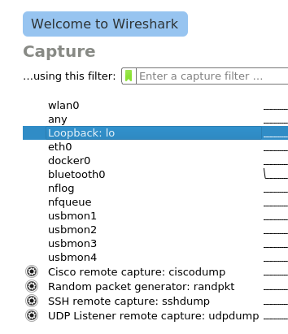
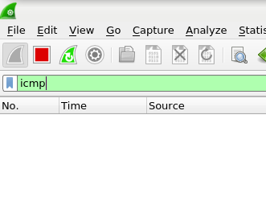
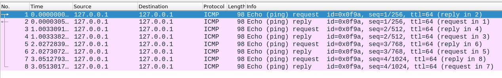
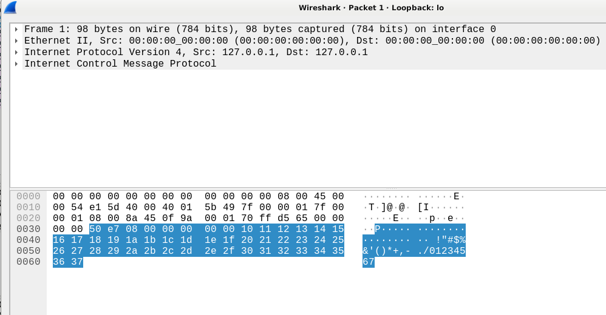
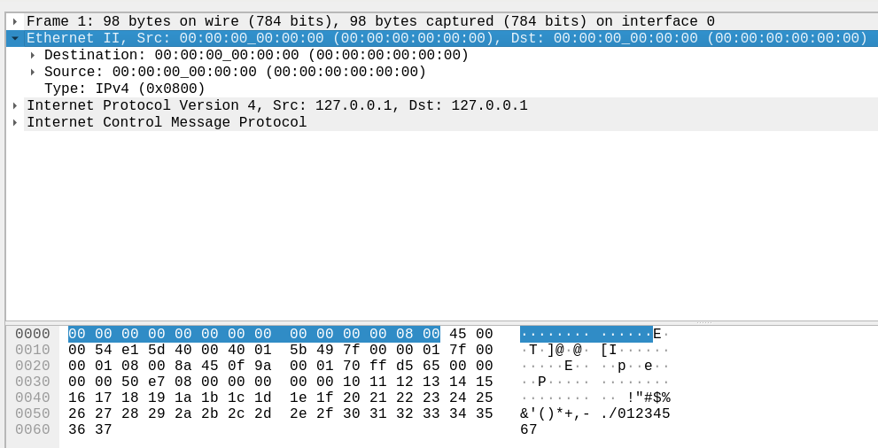
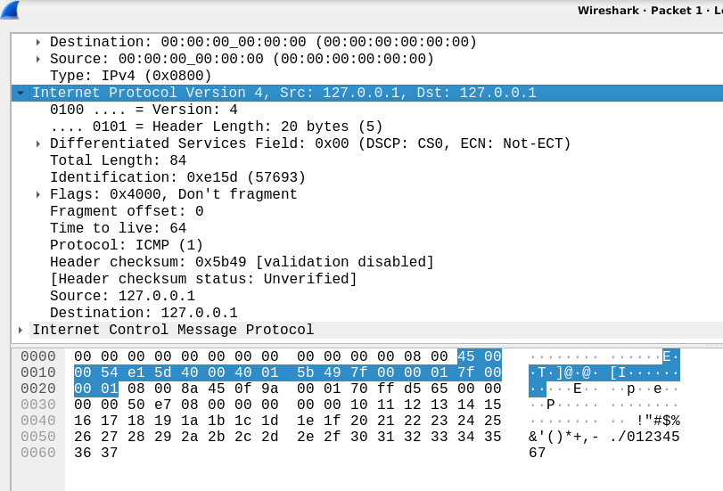
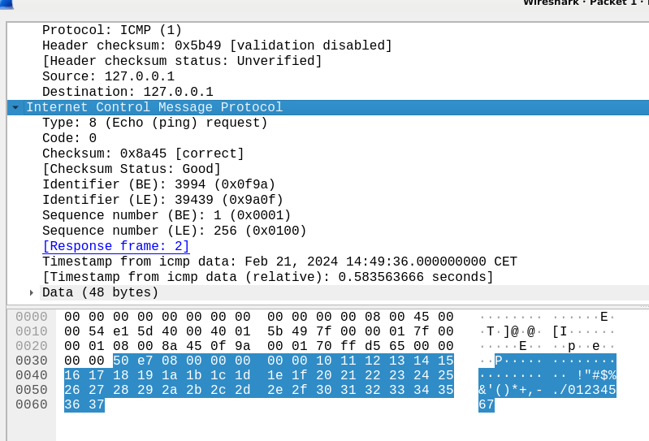
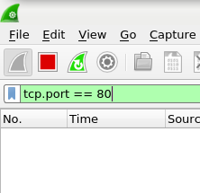
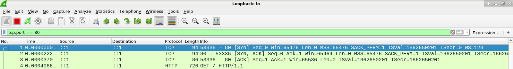

# Esercizi

Dopo aver installato il pacchetto software e le relative dipendente (`apt-get install wireshark`), avviare Wireshark da utente privilegiato:

    root@linux:/home/user# wireshark

## 1. Analisi traffico ICMP (ping localhost)

Selezionare l'interfaccia `Loopback: lo`:

Inserire il filtro `icmp`:

Aprire un terminale e digitare il comando `ping -c 4 127.0.0.1`

Durante il packet capturing, verrà visualizzato un output simile al seguente:

Facendo doppio click su di un messaggio `ICMP echo request (ping)` si aprirà una nuova finestra in cui analizzare nel dettaglio la composizione dell'intero pacchetto (in alternativa, è possibile visualizzare le stesse informazioni nella parte inferiore della finestra principale del programma):

Ad esempio, è interessante notare, per ciascun livello della pila protocollare, gli attributi fondamentali di ciascuna PDU.

Frame: source e destination MAC address.

Datagram IP: source e destination IP address, protocol, etc.

ICMP message: type, code, timestamp, etc.

## 2. Analisi TCP Three Way Handshake

Per lo svolgimento dell'esercizio è necessario aver installato il pacchetto software e le relative dipendente di Apache2: `apt-get install apache2`.

Accertarsi che l'applicazione server Apache2 sia correttamente funzionante, verificando lo stato del servizio: `systemctl status apache2.service`

All'interno di Wireshark selezionare l'interfaccia `Loopback: lo`:

Specificare il filtro `tcp.port == 80`

Aprire un browser e digitare `http://localhost` all'interno della barra degli indirizzi.

All'interno di Wireshark, il packet capturing restituirà un output simile al seguente:

`::1` rappresenta l'indirizzi IPv6 associato all'interfaccia di loopback; ovvero, l'analogo di `127.0.0.1` ma nell'ambito del protocollo dello strato di rete IPv6.

Procedere, poi, all'analisi di ciascun segmento TCP componente il *Three Way Handshake*.

## 3. Esercizio 3: a breve verranno pubblicati altri esercizi.