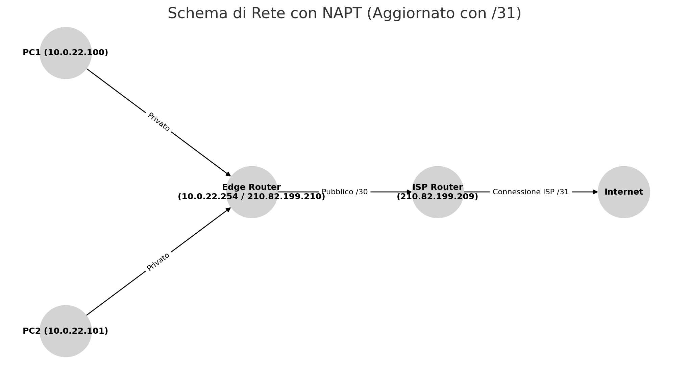

# Analisi scenario Peano

## Rete del Laboratorio

Nel nostro laboratorio, i dispositivi sono configurati su una rete privata con indirizzamento **10.0.22.0/24**. Il gateway predefinito della rete è **10.0.22.254**, ovvero l’indirizzo dell’interfaccia interna del router che si occupa di instradare il traffico verso l’esterno.

Per analizzare l’indirizzamento IP assegnato ai dispositivi all’interno della rete, possiamo utilizzare i seguenti comandi su un sistema Linux:

- **Visualizzare gli indirizzi IP assegnati**:
  - `ip a` (metodo moderno, consigliato)
  - `/sbin/ifconfig` (parte del pacchetto `net-tools`, ormai deprecato)
  
- **Verificare la tabella di routing e il gateway predefinito**:
  - `ip route show`
  - `netstat -nr`

Inoltre, utilizzando strumenti come `getmyip` (servizio Web) possiamo determinare quale indirizzo pubblico viene utilizzato per le connessioni verso l’esterno. Nel nostro caso, viene rilevato **213.82.199.210**.

---

## Struttura della Rete e Indirizzamento IP Pubblico

L'output del comando `whois` applicato all'IP pubblico mostra che l'ISP ha assegnato un range di **quattro indirizzi IP pubblici** all'istituto, compresi tra **213.82.199.208 e 213.82.199.211**. Questo suggerisce che la rete pubblica è stata configurata con una subnet di **maschera /30** (ovvero 255.255.255.252), sufficiente per gestire una comunicazione point-to-point tra il router dell'istituto e il router del provider.

La situazione può essere schematizzata come segue:

- L'ISP ha fornito un blocco **/30**, il che significa:
  - **.208** → Indirizzo di rete (non assegnabile)
  - **.209** → IP assegnato al primo router dell'ISP (lato pubblico dell'edge router)
  - **.210** → IP assegnato all'interfaccia esterna del nostro edge router
  - **.211** → Broadcast (non assegnabile)

Quindi, l’**interfaccia esterna del nostro edge router** è configurata con **213.82.199.210**, mentre il router dell’ISP, con cui il nostro router comunica direttamente, utilizza **213.82.199.209**.

Dopo questo primo collegamento, il router dell’ISP continuerà a instradare il traffico su un'altra subnet point-to-point **/31**, che collega questo router con un nodo superiore della rete del provider.  

Le subnet **/31** sono utilizzate nelle connessioni **point-to-point** tra router per ottimizzare l’uso degli indirizzi IP pubblici. In passato, le connessioni tra router utilizzavano **/30**, ma questo comportava lo spreco di due indirizzi (uno per la rete e uno per il broadcast).  

Con **RFC 3021** del Dicembre 2000, è stato stabilito che una rete **/31** può assegnare entrambi gli IP agli endpoint di un collegamento diretto tra due router, eliminando la necessità di un indirizzo di rete e di broadcast. Questo permette agli ISP di risparmiare **il 50% degli indirizzi IP** utilizzati per le connessioni tra i loro dispositivi.

---

## Perché l’ISP assegna una subnet /30 ai clienti invece di una /31?

Quando un ISP assegna una subnet **/30 (255.255.255.252)** a un cliente, il risultato pratico è che il cliente ha **solo un IP pubblico disponibile**, esattamente come in una **/31 (255.255.255.254)**. Tuttavia, l'ISP sceglie **/30** per ragioni di compatibilità e standardizzazione.

### 1. **Compatibilità con apparati di rete tradizionali**

Molti **router, firewall e bilanciatori di carico legacy** non supportano subnet **/31** o non sono stati progettati per operare senza un **indirizzo di rete** e un **broadcast**.  

- La subnet **/30** segue il modello classico:  
  **(rete - host - host - broadcast)**.
- Alcuni apparati di rete richiedono esplicitamente un **broadcast address** per funzionare.

### 2. **Standardizzazione delle assegnazioni ISP**

Molti ISP adottano **/30 come standard** per le subnet assegnate ai clienti perché:

- È **un formato tradizionale e universalmente supportato**.
- **Non richiede configurazioni particolari** nei dispositivi dei clienti.
- **Riduce problemi di compatibilità** e il carico di supporto tecnico.

Se l'ISP usasse **/31**, alcuni clienti con apparati obsoleti potrebbero avere problemi di configurazione, aumentando la necessità di interventi tecnici.

---

## Analisi del Percorso (tracepath)

Quando analizziamo il percorso con il comando `traceroute`, possiamo vedere chiaramente i passaggi seguenti:

1. **10.0.22.254** → Il primo hop è il gateway interno della rete del laboratorio, ovvero l’edge router.
2. **213.82.199.209** → Il secondo hop è l'interfaccia del router del provider a cui il nostro edge router è connesso direttamente tramite la subnet /30.
3. **Hop successivi** → Il traffico prosegue attraverso la rete del provider fino alla destinazione finale.

Questa configurazione conferma che il nostro **edge router funge da punto di transito tra la rete privata (10.0.22.0/24) e la rete pubblica (213.82.199.208/30), utilizzando NAT per gestire il traffico**.

---

### Schema di rete

---

## Network Address Port Translation (NAPT)

Poiché la rete interna utilizza indirizzi privati (10.0.22.0/24), il router deve eseguire una traduzione degli indirizzi per consentire ai dispositivi della LAN di comunicare con l'esterno. Questo avviene tramite un processo chiamato **NAPT (Network Address Port Translation)**, noto anche come **PAT (Port Address Translation)**.

### Come funziona il NAPT?

1. **Gli host interni** utilizzano IP privati non instradabili su Internet (ad es. 10.0.22.100).
2. **Il router sostituisce gli indirizzi privati** con il suo indirizzo pubblico (`213.82.199.210`) quando i pacchetti vengono inviati su Internet.
3. **Per distinguere le connessioni**, il router modifica anche le porte di origine, creando una tabella di associazione (IP privato/porta ↔ IP pubblico/porta).
4. **Quando arrivano le risposte**, il router utilizza la tabella per reinoltrare il traffico ai dispositivi corretti all'interno della LAN.

### Esempio di NAPT in azione

- Un client con IP **10.0.22.100** e porta sorgente **12345** invia una richiesta HTTP a un server su Internet.
- Il router modifica l'IP sorgente con **213.82.199.210**, mantenendo o cambiando la porta sorgente (es. 54321).
- Il server risponde a **213.82.199.210:54321**.
- Il router traduce nuovamente l'indirizzo e la porta per reinoltrare la risposta a **10.0.22.100:12345**.