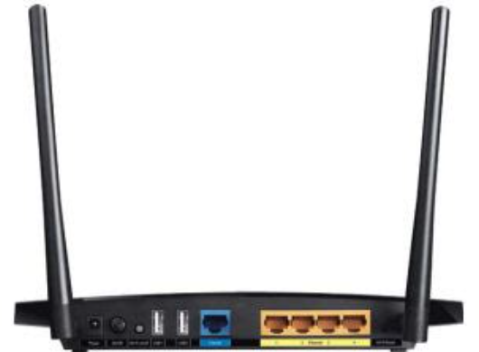

# Router Wi-Fi: configurazioni a confronto



## Scenario generale
- Router Wi-Fi **TP-Link Archer C5** che dispone delle seguenti interfacce:
  - **WAN (porta Ethernet dedicata)**
  - **LAN (4 porte Ethernet "switchate")**
  - **WLAN (interfaccia Wi-Fi con SSID configurabile)**

- Rete di laboratorio esistente: **LabInf2**
- Router Wi-Fi usato per creare/gestire rete Wi-Fi **PeanoWiFi_Labinf2**

---

## Modalità 1 – WAN → NAT + Routing

```code
[Client Wi-Fi]
  DHCP client
  IP: 192.168.0.100
        |
        | (WLAN)
        v
[Router Wi-Fi - Interfaccia WLAN]
  DHCP SERVER (192.168.0.0/24, GW 192.168.0.1)
        |
        |  Routing + NAT
        v
[Router Wi-Fi - Interfaccia WAN]
  DHCP CLIENT (IP da DHCP server "centrale", ci è stato assegnato 10.0.22.195/24, GW 10.0.22.254)
        |
        v
[Porta switch LabInf2]
        |
        v
[Router LabInf2]
  IP interno: 10.0.22.254/24
        |
        v
[Public Internet]
```

- **Cavo uplink**: connesso alla porta **WAN**  
- WAN configurata in **DHCP client** → riceve IP dal **DHCP server del laboratorio**  
- **LAN/WLAN**:
  - Router fa da **DHCP server** per i client Wi-Fi
  - Client ottengono IP privati (es. 192.168.0.0/24)
- **Funzionamento**:
  - Router esegue **NAT + routing** tra LAN/WLAN ↔ WAN
  - I client Wi-Fi sono in una rete distinta (es. 192.168.0.x)
  - Verso la rete del laboratorio, il router appare come un unico host (con l’IP assegnato via DHCP alla WAN)
- **Vantaggi**:
  - **Separazione di sicurezza** tra rete wireless e rete del laboratorio
  - Possibilità di politiche firewall, isolamento, ecc.
- **Svantaggi**:
  - Overhead configurazionale (due sottoreti, NAT attivo, doppio DHCP)
  - Accesso diretto alle risorse del laboratorio può richiedere configurazioni extra (port forwarding, ecc.)

---

## Modalità 2 – LAN → Bridge (LAN ↔ WLAN)

```code
[Client Wi-Fi]
  DHCP client
  (IP assegnato dal DHCP server del LabInf2, es. 10.0.22.101/24, GW 10.0.22.254)
        |
        | (WLAN bridged con LAN)
        v
[Router Wi-Fi - Interfaccia WLAN]
  (in bridge con porte LAN, NO NAT, NO DHCP server locale)
        |
        v
[Router Wi-Fi - Porta LAN]
  IP statico di gestione: 10.0.22.195/24
        |
        v
[Porta switch LabInf2]
        |
        v
[Router LabInf2]
  IP interno: 10.0.22.254/24
        |
        v
[Public Internet]
```

- **Cavo uplink**: connesso a una **porta LAN**
- LAN non può funzionare come DHCP client → serve **assegnare IP statico** del segmento del laboratorio (es. 10.0.22.x)
- **WLAN** in bridge con LAN → fanno parte dello stesso dominio broadcast
- **Funzionamento**:
  - Client Wi-Fi ricevono IP direttamente dal **DHCP server del laboratorio** (nessun NAT)
  - WLAN = semplice **Access Point**
- **Vantaggi**:
  - Configurazione semplice
  - Client Wi-Fi sono nello stesso segmento IP del laboratorio → accesso diretto alle risorse
- **Svantaggi**:
  - Nessuna separazione tra Wi-Fi e rete wired → **meno sicurezza**
  - Tutto il traffico wireless finisce sullo stesso dominio broadcast della rete a monte

---

## Confronto

| Caratteristica       | Modalità 1 (WAN + NAT)             | Modalità 2 (LAN bridge)         |
|----------------------|-------------------------------------|---------------------------------|
| Cablaggio uplink     | Porta WAN                          | Porta LAN                       |
| Configurazione IP    | DHCP client sulla WAN              | IP statico sulla LAN            |
| DHCP per i client    | Router Wi-Fi (192.168.x.x)         | DHCP server del laboratorio     |
| Rete dei client WiFi | Sottorete separata                 | Stesso segmento del laboratorio |
| NAT                  | Sì                                 | No                              |
| Sicurezza            | Maggiore (isolamento)              | Minore (tutti nella stessa rete)|
| Complessità          | Maggiore (NAT, doppio DHCP)        | Minore (bridge trasparente)     |

---

## Limitazioni del dispositivo

- Sulla **porta WAN** il router può funzionare come **DHCP client** (oppure PPPoE o IP statico).  
- Sulle **porte LAN**, invece, **non è possibile avere DHCP client**:  
  - l’IP del router deve essere sempre configurato **staticamente** se si usa una porta LAN come uplink.  
  - i client collegati alla WLAN in bridge con la LAN ricevono l’IP **direttamente dal DHCP server a monte**.  

Questo significa che in **Modalità 2 (LAN ↔ WLAN bridge)** l’amministratore deve assegnare manualmente al router un IP libero nella stessa rete del laboratorio (es. `10.0.22.200/24`).  

### Perché questa scelta?
- I router consumer sono progettati per scenari semplici, con la distinzione netta:
  - **WAN = “Internet”** (dove si comportano da client: DHCP, PPPoE, IP statico).  
  - **LAN = “rete interna”** (dove gestiscono gli indirizzi e fungono da server DHCP).  
- La possibilità di avere DHCP client su LAN è tipica di router/firewall più avanzati (pfSense, Mikrotik, OpenWrt, ecc.).  
